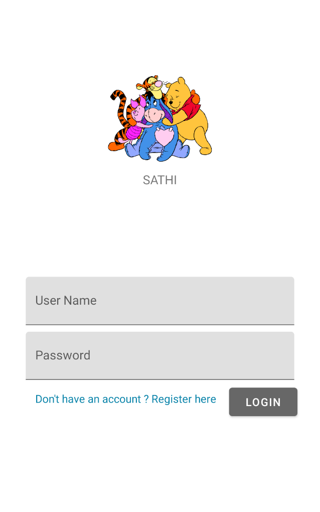
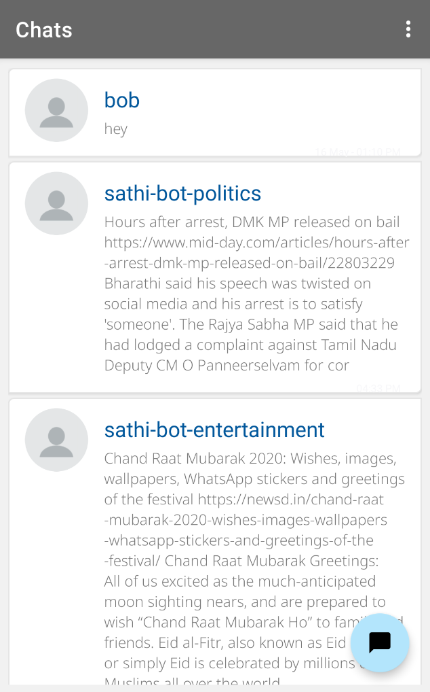
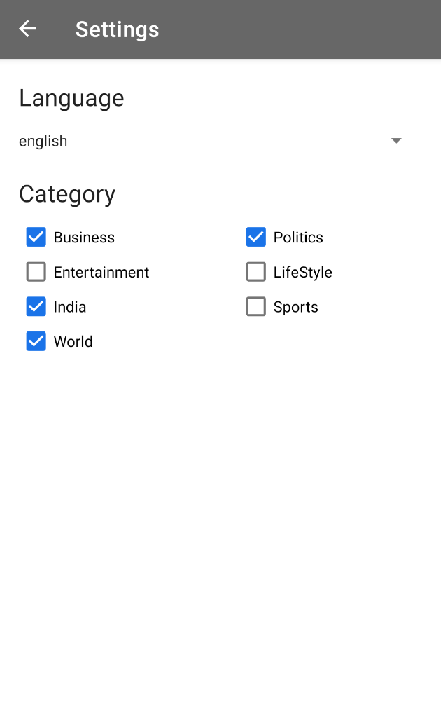

# Sathi---ChatApp

Master 

An android application which enables users to connect to each other through text messages and provides additional features like viewing the 'last seen' and reading status of others.

***Steps for getting the App***

* Clone the repo 
  * Clone the Sathi---ChatApp repo locally. In the terminal, run :
    git clone https://github.com/scalability4all/Sathi---ChatApp.git
  
* Open the repo with Android Studio. If Android studio is not already installed, can be downloaded from 
    http://developer.android.com/sdk/index.html
  
* To run the app follow the steps from : https://developer.android.com/training/basics/firstapp/running-app
  
* Apk can also be downloaded without android studio.
   Open terminal at the projects location:
   * On Mac/Linux:
        Run ./gradlew assembleDebug 
   * On Windows:
        Run gradlew assembleDebug
   This creates an APK named module_name-debug.apk in project_name/module_name/build/outputs/apk/. The file is already signed    with the debug key and aligned with zipalign, so you can immediately install it on a device.

***Sample Outputs:***

        
